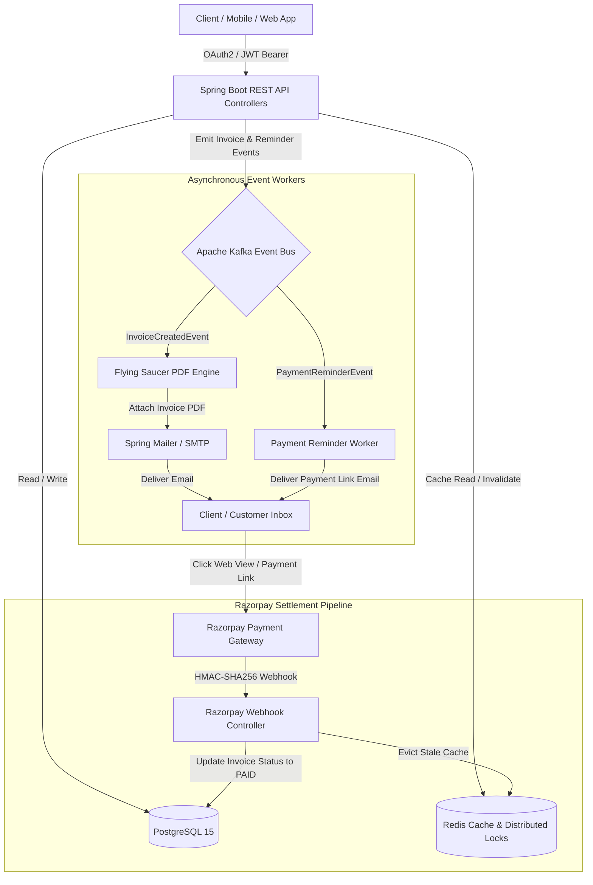

# ⚡ INVOICELY — Enterprise Invoice & Payment Management SaaS

[](https://www.oracle.com/java/)
[](https://spring.io/projects/spring-boot)
[](https://www.postgresql.org/)
[](https://kafka.apache.org/)
[](https://redis.io/)
[](https://razorpay.com/)
[](LICENSE)

**INVOICELY** is an enterprise-grade, high-performance, event-driven SaaS backend for automated invoicing, client billing, payment tracking, automated payment reminders, PDF generation, Razorpay gateway webhooks, and sub-millisecond real-time analytics.

Built with **Java 21**, **Spring Boot 3**, **Apache Kafka**, **Redis**, and **PostgreSQL**, INVOICELY demonstrates modern backend architecture patterns including event-driven microservices, distributed locking, reactive caching strategies, and secure OAuth2 / JWT authentication.

---

## 💡 System Architecture



---

## 🔥 Key Technical Highlights & Features

### 1. 🛡️ Authentication & Multi-Tenant Security
- **Stateless JWT Security Filter Chain**: Custom `JwtAuthenticationFilter` and `JwtService` validating signed JWT tokens on protected endpoints.
- **Google OAuth 2.0 Integration**: Seamless authentication verified using `com.google.api-client`.
- **Tenant Isolation**: Customer data and financial records strictly scoped by `business_id`.

### 2. ⚡ High-Performance Caching & Distributed Locks (Redis)
- **Sub-Millisecond Dashboard Reads**: `@Cacheable(value = "dashboard_summary", key = "#userEmail")` caches key metrics in Redis with a 10-minute TTL.
- **Automated Cache Invalidation**: `@CacheEvict` purges stale dashboard metrics immediately upon invoice creation or payment settlement.
- **Concurrency Control**: Custom `DistributedLockService` using Redis atomic `SETNX` commands to prevent race conditions across distributed server instances.

### 3. 📩 Event-Driven Architecture (Apache Kafka) & Async Workers
- **Event Bus Decoupling**: High-throughput Kafka topics (`invoice-created-topic`, `payment-reminders`).
- **Asynchronous PDF Generation**: Flying Saucer XML/HTML rendering engine generates crisp PDF invoices on-the-fly without blocking main HTTP threads.
- **Asynchronous Mail Delivery**: Spring Mailer dispatches formatted HTML emails with PDF attachments via background Kafka consumers.
- **Automated Payment Reminders**: Spring `@Scheduled` cron job (`InvoiceReminderScheduler`) queries pending/overdue invoices daily and triggers Kafka reminder workflows.

### 4. 💳 Razorpay Payment Gateway & Webhook Engine
- **Dynamic Payment Links**: `RazorpayService` auto-generates Razorpay payment links matching exact invoice due dates and Rupee-to-Paise precision math.
- **Webhook Cryptographic Verification**: `WebhookController` verifies incoming HMAC-SHA256 signatures via Razorpay SDK (`Utils.verifyWebhookSignature`).
- **Automated Settlement**: Automatically updates invoice lifecycle (`ISSUED` → `PAID`) and invalidates cache metrics upon payment confirmation.

### 5. 📄 Spring Data JPA Pagination & Financial Reports
- **Efficient Pagination & Sorting**: `Page<Invoice> findByBusinessId(UUID businessId, Pageable pageable)` with default page sizes and creation date sorting (`createdAt DESC`).
- **CSV Data Export**: `ReportService` exports complete business invoice summaries into CSV format.

---

## 🛠️ Tech Stack & Dependencies

| Layer | Technology |
| :--- | :--- |
| **Language & Runtime** | Java 21 (OpenJDK) |
| **Core Framework** | Spring Boot 3.4, Spring Data JPA, Spring Security, Spring MVC |
| **Database** | PostgreSQL 15 (Relational persistence) |
| **Caching & Locking** | Redis (Spring Data Redis, Jedis/Lettuce, Custom Distributed Locks) |
| **Message Broker** | Apache Kafka (Spring Kafka Producers & Consumers) |
| **Payment Gateway** | Razorpay Java SDK (`com.razorpay:razorpay-java`) |
| **PDF & Email** | Flying Saucer (`flying-saucer-pdf`), Thymeleaf, Spring Mail |
| **Testing** | JUnit 5, Mockito, Spring Boot Test |
| **Containerization** | Docker, Docker Compose |

---

## 🚀 Quick Start Guide

### Prerequisites
- **Java 21** or later
- **Docker Desktop** (for Kafka & Redis)
- **PostgreSQL 15+** (Listening on port `5433` by default)
- **Maven 3.8+** (or use `./mvnw`)

---

### Step 1: Clone Repository & Start Containers

```bash
git clone https://github.com/VaibhavSharmaggwp/invoicely-.git
cd invoicely-/backend

# Start Redis & Kafka Docker containers
docker-compose up -d
```

---

### Step 2: Configure Environment Variables

Create a `.env` file in the project root (use `.env.example` as a starting template):

```env
# Database & Infrastructure
DB_URL=jdbc:postgresql://localhost:5433/invoicely_db
DB_USERNAME=postgres
DB_PASSWORD=your_postgres_password
KAFKA_BOOTSTRAP_SERVERS=localhost:9092
REDIS_HOST=localhost
REDIS_PORT=6379

# Authentication & Payment Integration
GOOGLE_CLIENT_ID=your_google_client_id.apps.googleusercontent.com
RAZORPAY_KEY_ID=your_razorpay_key_id
RAZORPAY_KEY_SECRET=your_razorpay_key_secret
RAZORPAY_WEBHOOK_SECRET=your_razorpay_webhook_secret

# Mail Configuration
SPRING_MAIL_USERNAME=your_email@gmail.com
SPRING_MAIL_PASSWORD=your_app_password
```

---

### Step 3: Run Backend & Execute Tests

```bash
# Run Unit & Integration Tests
./mvnw test

# Launch Spring Boot Application
./mvnw spring-boot:run
```

The application starts on `http://localhost:8080`.

---

## 📌 REST API Endpoint Reference

| Method | Endpoint | Access | Description |
| :--- | :--- | :--- | :--- |
| `POST` | `/api/v1/auth/google` | Public | Google OAuth 2.0 Sign-In / Sign-Up |
| `GET` | `/api/v1/auth/dev-token` | Dev/Public | Generate dev JWT token for testing |
| `POST` | `/api/v1/businesses` | Authenticated | Register business profile |
| `GET` | `/api/v1/businesses/me` | Authenticated | Fetch current business profile |
| `POST` | `/api/v1/invoices` | Authenticated | Create invoice & emit Kafka event |
| `GET` | `/api/v1/invoices` | Authenticated | List all invoices for business |
| `GET` | `/api/v1/invoices?page=0&size=10` | Authenticated | Paginated & sorted invoice list |
| `GET` | `/api/v1/invoices/dashboard-summary` | Authenticated | Cached dashboard financial metrics |
| `GET` | `/api/v1/public/invoices/{id}` | Public | Public interactive invoice view with Razorpay CTA |
| `POST` | `/api/v1/webhooks/razorpay` | Public (HMAC Verified) | Razorpay webhook callback endpoint |

---

## 🧪 Testing & Quality Assurance

Comprehensive unit testing using **JUnit 5** and **Mockito** covers core domain logic, service layers, and pagination boundaries.

To execute the test suite:
```bash
./mvnw test
```

---

## 📝 License

This project is licensed under the MIT License — see the [LICENSE](LICENSE) file for details.

Developed with ❤️ by [Vaibhav Sharma](https://github.com/VaibhavSharmaggwp).
