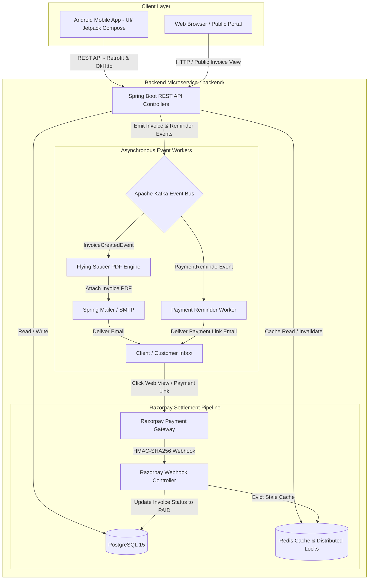

# ⚡ INVOICELY — Enterprise Invoice & Payment Management SaaS

[](https://www.oracle.com/java/)
[](https://spring.io/projects/spring-boot)
[](https://developer.android.com/jetpack/compose)
[](https://m3.material.io/)
[](https://www.postgresql.org/)
[](https://kafka.apache.org/)
[](https://redis.io/)
[](https://razorpay.com/)
[](LICENSE)

**INVOICELY** is an enterprise-grade, high-performance SaaS platform for automated invoicing, client billing, payment tracking, automated reminders, PDF generation, Razorpay gateway webhooks, and sub-millisecond real-time analytics. It features a native **Android Mobile Application** built with Jetpack Compose and a robust **Spring Boot 3** backend.

---

## 📁 Repository Structure

```
INVOICELY/
├── backend/            # Spring Boot 3 Java 21 REST API & Microservice Backend
├── UI/                 # Android Native App (Jetpack Compose, Material 3, Retrofit)
├── .env.example        # Environment variables reference template
└── README.md           # Master Documentation
```

---

## 💡 System Architecture



---

## 🔥 Key Technical Highlights & Features

### 1. 📱 Android UI App (`UI/`)
- **Modern Jetpack Compose & Material 3**: Built with a custom design system utilizing bespoke brand palettes (`Chartreuse`, `Ink`, `Cleared`) and custom Google Fonts (**Outfit** & **JetBrains Mono**).
- **Network Layer**: Powered by **Retrofit 2** & **OkHttp 4** with JSON content parsing (`converter-gson`) and logging interceptors for API communication with the Spring Boot backend.
- **Responsive Navigation**: Scaffold-based navigation system (`MainScaffold`) featuring a bottom navigation bar, floating action buttons (FAB), and smooth screen transitions.

### 2. 🛡️ Backend Authentication & Security (`backend/`)
- **Stateless JWT Security Filter Chain**: Custom `JwtAuthenticationFilter` and `JwtService` validating signed JWT tokens on protected endpoints.
- **Google OAuth 2.0 Integration**: Seamless authentication verified using `com.google.api-client`.
- **Tenant Isolation**: Customer data and financial records strictly scoped by `business_id`.

### 3. ⚡ Caching & Distributed Locks (Redis)
- **Sub-Millisecond Dashboard Reads**: `@Cacheable(value = "dashboard_summary", key = "#userEmail")` caches key metrics in Redis with a 10-minute TTL.
- **Automated Cache Invalidation**: `@CacheEvict` purges stale dashboard metrics immediately upon invoice creation or payment settlement.
- **Concurrency Control**: Custom `DistributedLockService` using Redis atomic `SETNX` commands to prevent race conditions.

### 4. 📩 Event-Driven Architecture (Apache Kafka) & Async Workers
- **Event Bus Decoupling**: High-throughput Kafka topics (`invoice-created-topic`, `payment-reminders`).
- **Asynchronous PDF Generation**: Flying Saucer XML/HTML rendering engine generates crisp PDF invoices without blocking main HTTP threads.
- **Asynchronous Mail Delivery**: Dispatches formatted HTML emails with PDF attachments via background Kafka consumers.
- **Automated Reminders**: Spring `@Scheduled` cron job queries pending/overdue invoices daily and triggers Kafka workflows.

### 5. 💳 Razorpay Payment Gateway & Webhook Engine
- **Dynamic Payment Links**: `RazorpayService` auto-generates payment links with Rupee-to-Paise precision math.
- **Webhook HMAC Verification**: `WebhookController` verifies incoming signatures via Razorpay SDK (`Utils.verifyWebhookSignature`).
- **Automated Settlement**: Updates invoice lifecycle (`ISSUED` → `PAID`) and invalidates cache metrics upon payment confirmation.

---

## 🛠️ Tech Stack & Dependencies

| Layer | Component | Technology / Library |
| :--- | :--- | :--- |
| **Mobile App (`UI/`)** | UI Framework | Jetpack Compose, Material 3, Compose Navigation |
| | Networking | Retrofit 2.11, OkHttp 4.12, Gson Converter |
| | Typography & Theme | Custom Google Fonts (Outfit, JetBrains Mono), MaterialTheme |
| | Target SDK | Android 35 (Kotlin 2.0) |
| **Backend (`backend/`)** | Language & Runtime | Java 21 (OpenJDK) |
| | Core Framework | Spring Boot 3.4, Spring Data JPA, Spring Security, Spring MVC |
| | Database | PostgreSQL 15 (Relational persistence) |
| | Caching & Locking | Redis (Spring Data Redis, Jedis/Lettuce, Distributed Locks) |
| | Message Broker | Apache Kafka (Spring Kafka Producers & Consumers) |
| | Payment Gateway | Razorpay Java SDK (`com.razorpay:razorpay-java`) |
| | PDF & Email | Flying Saucer (`flying-saucer-pdf`), Thymeleaf, Spring Mail |
| | Containerization | Docker, Docker Compose |

---

## 🚀 Quick Start Guide

### 1. Spring Boot Backend (`backend/`) Setup

#### Prerequisites
- **Java 21** or later
- **Docker Desktop** (for Kafka & Redis)
- **PostgreSQL 15+** (Listening on port `5433` by default)
- **Maven 3.8+** (or use `./mvnw`)

```bash
cd backend

# Start Redis & Kafka Docker containers
docker-compose up -d
```

Configure `.env` in the root directory (refer to `.env.example`):
```env
DB_URL=jdbc:postgresql://localhost:5433/invoicely_db
DB_USERNAME=postgres
DB_PASSWORD=your_postgres_password
KAFKA_BOOTSTRAP_SERVERS=localhost:9092
REDIS_HOST=localhost
REDIS_PORT=6379
GOOGLE_CLIENT_ID=your_google_client_id.apps.googleusercontent.com
RAZORPAY_KEY_ID=your_razorpay_key_id
RAZORPAY_KEY_SECRET=your_razorpay_key_secret
RAZORPAY_WEBHOOK_SECRET=your_razorpay_webhook_secret
SPRING_MAIL_USERNAME=your_email@gmail.com
SPRING_MAIL_PASSWORD=your_app_password
```

Run Backend:
```bash
./mvnw spring-boot:run
```
Backend runs on `http://localhost:8080`.

---

### 2. Android Mobile App (`UI/`) Setup

#### Prerequisites
- **Android Studio** (Ladybug / Jellyfish or latest recommended)
- **Android SDK 35**
- **JDK 17 or 21**

```bash
cd UI

# Build debug APK
./gradlew assembleDebug
```

- Open the `UI/` directory in Android Studio.
- Run on an Android Emulator or physical device. (Note: For local emulator communication with Spring Boot backend, set base URL to `http://10.0.2.2:8080/`).

---

## 📌 REST API Endpoint Reference

| Method | Endpoint | Access | Description |
| :--- | :--- | :--- | :--- |
| `POST` | `/api/v1/auth/google` | Public | Google OAuth 2.0 Sign-In / Sign-Up |
| `GET` | `/api/v1/auth/dev-token` | Dev/Public | Generate dev JWT token for testing |
| `POST` | `/api/v1/businesses` | Authenticated | Register business profile |
| `GET` | `/api/v1/businesses/me` | Authenticated | Fetch current business profile |
| `POST` | `/api/v1/invoices` | Authenticated | Create invoice & emit Kafka event |
| `GET` | `/api/v1/invoices` | Authenticated | List all invoices for business |
| `GET` | `/api/v1/invoices?page=0&size=10` | Authenticated | Paginated & sorted invoice list |
| `GET` | `/api/v1/invoices/dashboard-summary` | Authenticated | Cached dashboard financial metrics |
| `GET` | `/api/v1/public/invoices/{id}` | Public | Public interactive invoice view with Razorpay CTA |
| `POST` | `/api/v1/webhooks/razorpay` | Public (HMAC Verified) | Razorpay webhook callback endpoint |

---

## 📝 License

This project is licensed under the MIT License — see the [LICENSE](LICENSE) file for details.

Developed with ❤️ by [Vaibhav Sharma](https://github.com/VaibhavSharmaggwp).

