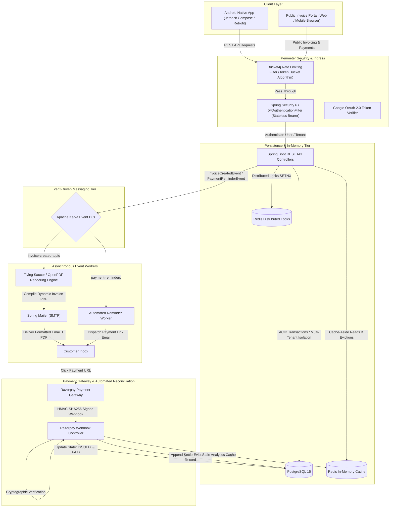

# ⚡ INVOICELY — Enterprise Distributed Billing & Financial SaaS Engine

[](https://www.oracle.com/java/)
[](https://spring.io/projects/spring-boot)
[](https://spring.io/projects/spring-security)
[](https://kafka.apache.org/)
[](https://redis.io/)
[](https://www.postgresql.org/)
[](https://github.com/bucket4j/bucket4j)
[](https://razorpay.com/)
[](https://developer.android.com/jetpack/compose)

**INVOICELY** is a high-performance, distributed financial SaaS engine and billing microservice platform. Engineered from the ground up to explore and implement **mission-critical backend system design patterns**, the platform delivers sub-millisecond cached analytics, distributed concurrency control, event-driven asynchronous processing, idempotent payment reconciliation, and ironclad multi-tenant data isolation.

It is accompanied by a native **Jetpack Compose Android reference client** that demonstrates the live backend capabilities through real-time financial ledgers, digital paper vouchers, and dynamic financial dashboards.

---

## 🏛️ System Architecture & Data Flow



---

## 🎯 Backend Engineering Pillars

### 1. ⚡ Event-Driven Asynchronous Processing (Apache Kafka)
- **Decoupled Business Logic**: Critical HTTP request paths (such as `POST /api/v1/invoices`) execute synchronously with database durability, then publish domain events (`InvoiceCreatedEvent`, `PaymentReminderEvent`) to Apache Kafka topics.
- **Offloaded Heavy Compute**: Heavy tasks—such as compiling Thymeleaf templates into PDFs via the Flying Saucer engine and dispatching SMTP emails with binary attachments—run strictly asynchronously in worker threads, keeping API latency ultra-low.
- **At-Least-Once Delivery**: Kafka consumer groups (`NotificationConsumer`) ensure reliable message delivery and resilience against downstream SMTP or PDF rendering failures.

### 2. 🚀 Low-Latency Caching & Distributed Concurrency Control (Redis)
- **Sub-Millisecond Financial Analytics**: Dashboard metrics, revenue aggregations, and recent transaction summaries are cached via Spring Data Redis (`@Cacheable(value = "dashboard_summary", key = "#businessId")`) with a configurable TTL.
- **Zero-Stale Data via Automated Eviction**: Stale caches are atomically invalidated (`@CacheEvict`) upon any state-mutating event—such as issuing a new invoice or reconciling a payment webhook.
- **Distributed Locking (`DistributedLockService`)**: Utilizes Redis atomic `SETNX` (set if not exists) primitives with expiration safety to coordinate scheduled jobs (`InvoiceReminderScheduler`) across horizontally scaled backend replicas, preventing duplicate reminders or race conditions.

### 3. 🛡️ Perimeter Defense & Multi-Tenant Security (Spring Security 6 + Bucket4j)
- **Stateless JWT Filter Chain**: Custom `JwtAuthenticationFilter` validates signed HMAC tokens on every protected endpoint, populating the `SecurityContext` with verified user claims.
- **Multi-Tenant Data Isolation**: Every business entity and transaction is strictly partitioned by `business_id`. All repository queries enforce tenant isolation at the database query layer.
- **Per-IP Rate Limiting (Bucket4j)**: `RateLimitFilter` enforces a token-bucket rate limiting strategy per client IP address. Malicious traffic or brute-force attempts are immediately choked with `HTTP 429 Too Many Requests`.
- **Hybrid Auth**: Fully supports native PBKDF2/BCrypt credential authentication alongside Google OAuth 2.0 ID Token verification via Google API Client.

### 4. 💳 Automated Payment Gateway Reconciliation & Webhooks (Razorpay)
- **Dynamic Payment Links**: Automated generation of secure Razorpay payment URLs with exact rupee-to-paise precision arithmetic to prevent floating-point rounding discrepancies.
- **HMAC-SHA256 Signature Verification**: Inbound webhooks (`/api/v1/webhooks/razorpay`) undergo cryptographic validation (`Utils.verifyWebhookSignature`) before payload processing, preventing replay attacks or payload tampering.
- **Cumulative Payment Ledger**: Automatic partial and full settlement tracking via `PaymentHistory` records, managing transition through the lifecycle state machine (`DRAFT` → `ISSUED` → `PARTIALLY_PAID` / `PAID` → `OVERDUE`).
- **Live Financial Audit Trail**: Unified API endpoint (`GET /api/v1/invoices/history`) merging real payment settlements, invoice issuances, and overdue accounts sorted chronologically by database `LocalDateTime` timestamps.

### 5. 📄 High-Fidelity PDF Generation & Automated Reminders
- **Headless Document Compilation**: Transforms XML/XHTML Thymeleaf templates into vector-grade PDF invoices using Flying Saucer (`org.xhtmlrenderer:flying-saucer-pdf-openpdf`).
- **Automated Overdue Auditing**: Background cron scheduler scans for overdue accounts and automatically enqueues reminder events to Kafka without blocking active transactions.
- **Financial CSV Export**: Dynamic streaming export (`GET /api/v1/reports/export`) for external bookkeeping and accounting software reconciliation.

---

## 📱 Client Application — Android Jetpack Compose

While the primary focus is backend mastery, Invoicely includes a production-grade **Android Native Application** built with **Jetpack Compose** and **Material 3** to serve as a real-world client consumer:

- **Financial Ledger Screen (`HistoryScreen.kt`)**: Displays real-time settled inflow hero metrics, live ledger tags, client search, filter chips (`ALL`, `SETTLED`, `ISSUED`, `OVERDUE`), and interactive transaction receipt bottom sheets with direct navigation to related invoices.
- **Bento Financial Dashboard**: High-contrast, card-based dashboard showing monthly revenue, settled vs. outstanding volume, and quick action workflows.
- **Digital Paper Receipt**: Perforated digital voucher view with dash-path Canvas borders, dynamic payment links, and native Android sharing (`Intent.ACTION_SEND`).
- **Reactive MVI Architecture**: Powered by ViewModels, Kotlin Coroutines, and Retrofit 2 with zero mock data—every screen binds directly to live Spring Boot REST endpoints.

---

## 🛠️ Complete Technology Stack

| Layer | Component | Technology / Library | Version |
| :--- | :--- | :--- | :--- |
| **Backend Core** | Runtime & Language | Java (OpenJDK LTS) | 21 |
| | Application Framework | Spring Boot (Web MVC, Data JPA, Security) | 3.4.1 |
| | Database | PostgreSQL (Relational Persistence) | 15+ |
| | Connection Pooling | HikariCP | 5.x |
| **Distributed Systems** | Message Broker | Apache Kafka | 3.x |
| | In-Memory Cache & Locks | Redis (Lettuce Client) | 7.x |
| | Distributed Locks | Redis Atomic SETNX Primitive | Custom Service |
| | Perimeter Defense | Bucket4j Core (Token Bucket) | 8.3.0 |
| **Integrations** | Payment Gateway | Razorpay Java SDK | 1.4.3 |
| | PDF Rendering | Flying Saucer OpenPDF | 9.4.0 |
| | Email Engine | Spring Mailer / JavaMailSender | 3.4.1 |
| | Template Engine | Thymeleaf | 3.x |
| | Identity & Tokens | JJWT (JSON Web Token), Google API Client | 0.11.5 / 2.2.0 |
| **Mobile Client** | Architecture | Jetpack Compose, Material 3, MVI | Kotlin 2.0 |
| | Networking | Retrofit 2.11, OkHttp 4.12, Gson | - |

---

## 📡 Comprehensive REST API Specification

### 🔐 Authentication (`/api/v1/auth`)
| Method | Endpoint | Access | Description |
| :--- | :--- | :--- | :--- |
| `POST` | `/api/v1/auth/signup` | Public | Register new merchant business (email, password, phone, business name) |
| `POST` | `/api/v1/auth/login` | Public | Authenticate merchant credentials and return stateless JWT bearer token |
| `POST` | `/api/v1/auth/google` | Public | Verify Google OAuth 2.0 ID Token and authenticate/provision merchant |
| `GET` | `/api/v1/auth/dev-token` | Dev/Public | Generate immediate JWT token for local API and curl testing |

### 📄 Invoices & Ledger (`/api/v1/invoices`)
| Method | Endpoint | Access | Description |
| :--- | :--- | :--- | :--- |
| `POST` | `/api/v1/invoices` | Authenticated | Create invoice with auto customer provisioning and server-side GST math |
| `GET` | `/api/v1/invoices` | Authenticated | List all invoices for authenticated business tenant |
| `GET` | `/api/v1/invoices?page=0&size=10` | Authenticated | Paginated and sorted invoice collection |
| `GET` | `/api/v1/invoices/{id}` | Authenticated | Fetch single invoice detail with customer, line items, and tax breakdown |
| `GET` | `/api/v1/invoices/{id}/pdf` | Authenticated | Generate and stream downloadable invoice PDF |
| `POST` | `/api/v1/invoices/{id}/payment-link` | Authenticated | Generate unique Razorpay payment link URL |
| `POST` | `/api/v1/invoices/{id}/payments` | Authenticated | Manually record an offline payment (Cash, Bank Transfer, Cheque) |
| `GET` | `/api/v1/invoices/history` | Authenticated | **Unified Financial Ledger**: Real payment settlements and invoice lifecycle audit trail |
| `GET` | `/api/v1/invoices/dashboard-summary` | Authenticated | Cached revenue, outstanding dues, and recent activity metrics |

### 🌐 Public Portal & Webhooks (`/api/v1/public`, `/api/v1/webhooks`)
| Method | Endpoint | Access | Description |
| :--- | :--- | :--- | :--- |
| `GET` | `/api/v1/public/invoices/{id}` | Public | Public read-only digital invoice view for clients |
| `POST` | `/api/v1/webhooks/razorpay` | Public (HMAC Verified) | Process Razorpay payment webhooks with cryptographic HMAC-SHA256 signature verification |

### 📊 Reports & Business Profile (`/api/v1/reports`, `/api/v1/business`)
| Method | Endpoint | Access | Description |
| :--- | :--- | :--- | :--- |
| `GET` | `/api/v1/reports/summary` | Authenticated | Aggregated financial metrics across custom date ranges |
| `GET` | `/api/v1/reports/export` | Authenticated | Stream dynamic financial report as downloadable CSV |
| `GET` | `/api/v1/business/profile` | Authenticated | Retrieve profile and settings of current authenticated merchant |
| `PUT` | `/api/v1/business/profile` | Authenticated | Update business metadata, contact details, or tax numbers |

---

## 🚀 Local Development & Environment Setup

### 1. Prerequisites
- **Java 21 LTS** (`java -version`)
- **Docker & Docker Compose** (for Kafka, Zookeeper, and Redis)
- **PostgreSQL 15+** (default port `5432` or `5433`)
- **Maven 3.8+** (or bundled `./mvnw`)

### 2. Infrastructure Spin-Up (Docker Compose)
A ready-to-run `docker-compose.yml` is provided inside `backend/` to orchestrate Redis, Kafka, and Zookeeper:

```bash
cd backend
docker-compose up -d
```

### 3. Environment Configuration
Create an `.env` file in the root directory (refer to `.env.example`):
```env
# Database Credentials
DB_URL=jdbc:postgresql://localhost:5433/invoicely_db
DB_USERNAME=postgres
DB_PASSWORD=your_postgres_password

# Distributed Messaging & Caching
KAFKA_BOOTSTRAP_SERVERS=localhost:9092
REDIS_HOST=localhost
REDIS_PORT=6379

# Security & OAuth
JWT_SECRET=your_base64_or_hex_encoded_256_bit_jwt_secret_key
GOOGLE_CLIENT_ID=your_google_client_id.apps.googleusercontent.com

# Razorpay Gateway & Webhooks
RAZORPAY_KEY_ID=rzp_test_your_key_id
RAZORPAY_KEY_SECRET=your_key_secret
RAZORPAY_WEBHOOK_SECRET=your_webhook_secret

# SMTP Mail Notification Engine
SPRING_MAIL_USERNAME=your_email@gmail.com
SPRING_MAIL_PASSWORD=your_app_password
```

### 4. Build and Run Backend
```bash
cd backend

# Compile and run test suite
mvn clean test-compile

# Start the Spring Boot microservice
./mvnw spring-boot:run
```
The backend starts on `http://localhost:8080`.

---

## 🧪 Testing & Verification

```bash
# Run unit and integration tests
mvn test

# Verify production package build
mvn clean package -DskipTests
```

---

## 📝 License

This project is licensed under the MIT License — see the [LICENSE](LICENSE) file for details.

Developed with ☕ & ❤️ by [Vaibhav Sharma](https://github.com/VaibhavSharmaggwp).
