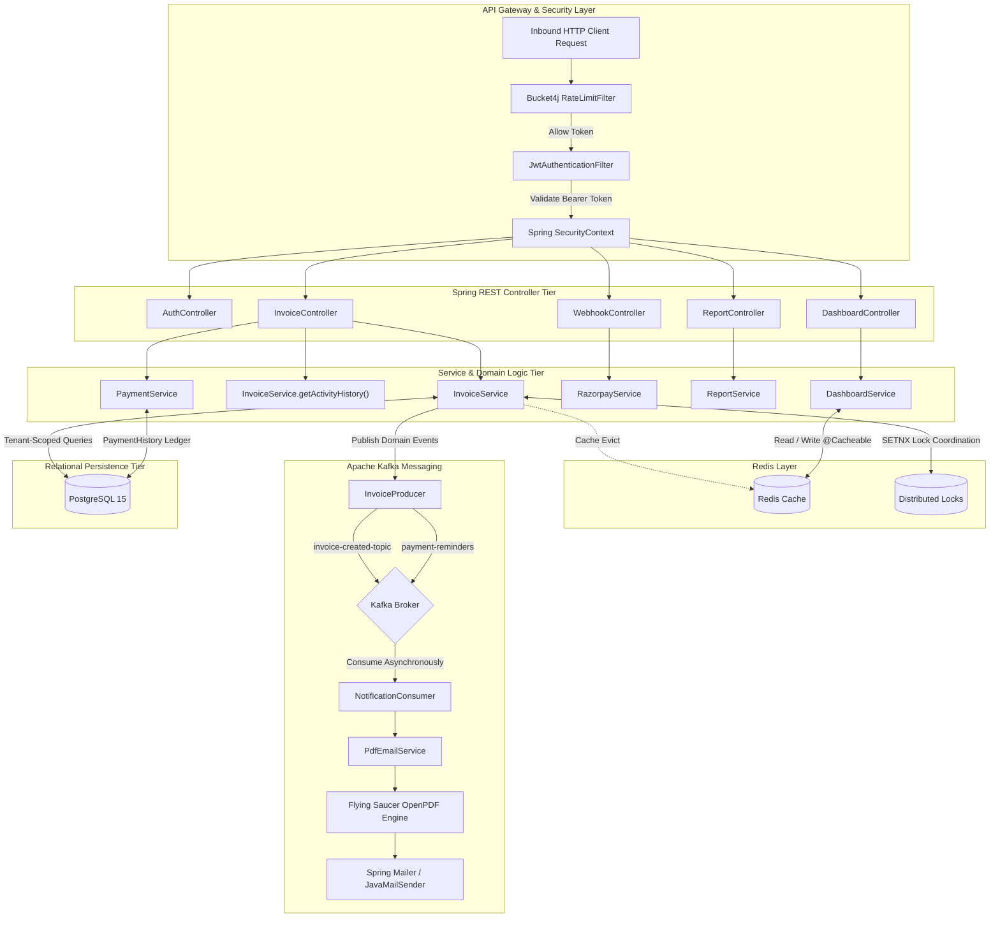

# 🧾 INVOICELY — Backend Microservice & Billing Engine

[](https://www.oracle.com/java/)
[](https://spring.io/projects/spring-boot)
[](https://spring.io/projects/spring-security)
[](https://kafka.apache.org/)
[](https://redis.io/)
[](https://github.com/bucket4j/bucket4j)
[](https://www.postgresql.org/)
[](https://razorpay.com/)

**Invoicely Backend** is an enterprise-grade, distributed financial REST API microservice built on **Spring Boot 3 (Java 21 LTS)**. It is architected for high throughput, sub-millisecond response caching, resilient distributed locking, event-driven asynchronous processing, idempotent webhook reconciliation, and strict multi-tenant data isolation.

---

## 🏗️ System Architecture



---

## 💡 Key Architectural Design Patterns

### 1. Event-Driven Architecture (Apache Kafka)
- **Producer / Consumer Decoupling**: Invoice creation does not wait for template compilation, PDF rendering, or SMTP handshakes. It records the transaction durably in PostgreSQL and publishes an `InvoiceCreatedEvent` to Kafka.
- **Dedicated Topics**:
  - `invoice-created-topic`: Handles document compilation and customer delivery.
  - `payment-reminders`: Coordinates overdue and scheduled reminder dispatches.
- **Consumer Fault Tolerance**: Independent Kafka consumer groups prevent notification bottlenecks from degrading transaction processing throughput.

### 2. Low-Latency Caching & Cache Invalidation (Redis)
- **Cache-Aside Pattern**: Dashboard statistics, monthly revenue calculations, and customer summaries are cached in Redis (`@Cacheable(value = "dashboard_summary", key = "#businessId")`).
- **Atomic Cache Eviction**: Whenever an invoice is issued or a payment is registered (manually or via webhook), the associated cache keys are evicted immediately (`@CacheEvict`) to guarantee read consistency.

### 3. Distributed Concurrency Control (Redis Locks)
- **Multi-Node Job Coordination**: Background cron schedulers (`InvoiceReminderScheduler`) obtain atomic distributed locks via Redis (`DistributedLockService`) using the `SETNX` (set if not exists) pattern with expiration safety.
- **Race Condition Prevention**: Prevents double-execution of invoice reminder emails or payment reconciliations when scaling the backend horizontally across multiple containers.

### 4. Idempotent Payment Reconciliation (Razorpay Webhooks)
- **Cryptographic HMAC-SHA256 Verification**: Webhooks from Razorpay are verified against the raw request signature using `Utils.verifyWebhookSignature`, preventing tampering or replay attacks.
- **Automated Settlement State Machine**: Webhook events parse payments, record individual settlement audit rows in `PaymentHistory`, compute cumulative paid balances, and update the invoice lifecycle (`DRAFT` → `ISSUED` → `PARTIALLY_PAID` / `PAID` → `OVERDUE`).

### 5. Perimeter Rate Limiting (Bucket4j)
- **Token Bucket Defense**: Inbound traffic passes through `RateLimitFilter` powered by **Bucket4j**, maintaining per-client token buckets.
- **Brute-Force & DDoS Mitigation**: Excess requests beyond rate capacity are rejected immediately with `HTTP 429 Too Many Requests`.

### 6. Stateless Multi-Tenant Security (Spring Security 6)
- **Stateless JWT Chain**: JSON Web Tokens with HMAC-SHA256 signatures validate merchant credentials without server-side session state.
- **Strict Tenant Isolation**: All queries join against `business.id`, guaranteeing zero cross-merchant data leakage.

---

## 🗄️ Relational Data Model (PostgreSQL)

```
┌─────────────────┐       1:N       ┌─────────────────┐       1:N       ┌─────────────────┐
│    Business     │────────────────▶│     Invoice     │────────────────▶│   InvoiceItem   │
│  (Merchant/Org) │                 │(Status, Amounts)│                 │ (Qty, UnitPrice)│
└─────────────────┘                 └─────────────────┘                 └─────────────────┘
         │                                   │ 1:N
         │ 1:N                               ▼
         │                          ┌─────────────────┐
         │                          │ PaymentHistory  │
         │                          │ (Method, UTR,   │
         │                          │  Amount, Date)  │
         ▼                          └─────────────────┘
┌─────────────────┐
│    Customer     │
│ (Client Profile)│
└─────────────────┘
```

- **`Business`**: Root multi-tenant entity representing the registered merchant, tax numbers, contact information, and billing configuration.
- **`Customer`**: Client profile scoped to a specific business.
- **`Invoice`**: The core billing entity holding the generated invoice number, issue/due dates, subtotal, GST percentage, total amount, status (`InvoiceStatus`), and memo.
- **`InvoiceItem`**: Line item detail with descriptions, unit prices, quantities, and line totals.
- **`PaymentHistory`**: Append-only ledger recording actual payment settlements, transaction IDs / bank UTR numbers, payment methods (`RAZORPAY`, `UPI`, `BANK_TRANSFER`, `CASH`), and timestamps.

---

## 📡 REST API Endpoint Reference

### 🔐 Authentication (`/api/v1/auth`)
| HTTP Method | Route | Description | Auth Required |
| :--- | :--- | :--- | :--- |
| `POST` | `/api/v1/auth/signup` | Register new business account | No |
| `POST` | `/api/v1/auth/login` | Authenticate credentials and receive JWT | No |
| `POST` | `/api/v1/auth/google` | Authenticate via Google OAuth 2.0 ID Token | No |
| `GET` | `/api/v1/auth/dev-token` | Generate development JWT token | No |

### 📄 Invoices & Ledger (`/api/v1/invoices`)
| HTTP Method | Route | Description | Auth Required |
| :--- | :--- | :--- | :--- |
| `POST` | `/api/v1/invoices` | Create invoice with server-side GST recalculation | Yes |
| `GET` | `/api/v1/invoices` | Retrieve all invoices for authenticated business | Yes |
| `GET` | `/api/v1/invoices/{id}` | Retrieve single invoice details with line items | Yes |
| `GET` | `/api/v1/invoices/{id}/pdf` | Compile and stream high-fidelity invoice PDF | Yes |
| `POST` | `/api/v1/invoices/{id}/payment-link` | Generate unique Razorpay payment link | Yes |
| `POST` | `/api/v1/invoices/{id}/payments` | Record offline/manual settlement | Yes |
| `GET` | `/api/v1/invoices/history` | **Financial Ledger**: Real chronological activity feed of settlements and invoice events | Yes |
| `GET` | `/api/v1/invoices/dashboard-summary` | Cached revenue and invoice count aggregates | Yes |

### 🌐 Public Portal & Webhooks (`/api/v1/public`, `/api/v1/webhooks`)
| HTTP Method | Route | Description | Auth Required |
| :--- | :--- | :--- | :--- |
| `GET` | `/api/v1/public/invoices/{id}` | Public read-only invoice view for clients | No |
| `POST` | `/api/v1/webhooks/razorpay` | Razorpay webhook callback (HMAC verified) | No (HMAC Verified) |

### 📊 Reports & Business Settings (`/api/v1/reports`, `/api/v1/business`)
| HTTP Method | Route | Description | Auth Required |
| :--- | :--- | :--- | :--- |
| `GET` | `/api/v1/reports/summary` | Aggregate financial breakdown by date range | Yes |
| `GET` | `/api/v1/reports/export` | Download financial activity report as CSV | Yes |
| `GET` | `/api/v1/business/profile` | Retrieve authenticated merchant profile | Yes |

---

## ⚙️ Configuration & Environment Reference

| Property Key | Example Value | Description |
| :--- | :--- | :--- |
| `spring.datasource.url` | `jdbc:postgresql://localhost:5433/invoicely_db` | PostgreSQL connection URL |
| `spring.datasource.username` | `postgres` | Database username |
| `spring.datasource.password` | `your_secure_password` | Database password |
| `spring.kafka.bootstrap-servers` | `localhost:9092` | Kafka cluster bootstrap host/port |
| `spring.data.redis.host` | `localhost` | Redis server hostname |
| `spring.data.redis.port` | `6379` | Redis server port |
| `app.jwt.secret` | `<256-bit-key>` | Secret key for signing/verifying JWT tokens |
| `app.razorpay.key-id` | `rzp_test_...` | Razorpay API Key ID |
| `app.razorpay.key-secret` | `...` | Razorpay API Key Secret |
| `app.razorpay.webhook-secret` | `...` | Razorpay Webhook HMAC Secret |
| `spring.mail.username` | `mailer@invoicely.app` | SMTP sender email |
| `spring.mail.password` | `app_specific_password` | SMTP sender authentication password |

---

## 🚀 Running Locally

### 1. Start Infrastructure Containers
```bash
docker-compose up -d
```
Verifies running containers for:
- **Zookeeper** (port `2181`)
- **Kafka** (port `9092`)
- **Redis** (port `6379`)

### 2. Verify and Compile
```bash
mvn clean test-compile
```

### 3. Run Application
```bash
./mvnw spring-boot:run
```
The API server listens on `http://localhost:8080`.

---

## 🛡️ License

This project is licensed under the MIT License — see the [LICENSE](../LICENSE) file for details.
